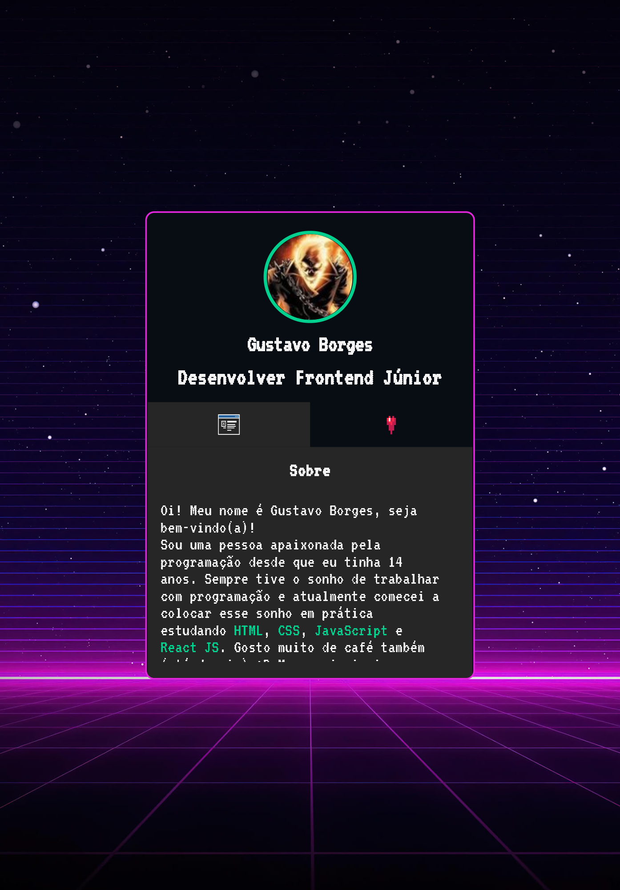

# Mini portfólio

## Índice
* [Introdução](#%EF%B8%8F-introdução)
* [Tecnologias utilizadas](#%EF%B8%8F-tecnologias-utilizadas)
* [Ferramentas utilizadas](#%EF%B8%8F-ferramentas-utilizadas)
* [Serviços utilizados](#-serviços-utilizados)
* [Funcionalidades do projeto](#-funcionalidades-do-projeto)
* [Acesso ao projeto](#-acesso-ao-projeto)
* [Autor](#-autor)
* [Contato](#%EF%B8%8F-contato)

# 

## ⚙️ Introdução 

Projeto para a criação de um mini portfólio apresentando algumas informações pessoais e redes sociais, criado durante o evento da Mapa Dev Week.

#

## 🖥️ Tecnologias utilizadas

- ``HTML``
- ``CSS``
- ``JavaScript``

## 🛠️ Ferramentas utilizadas

- ``PhpStorm``

## 🧰 Serviços utilizados

- ``Github``

#

## 🪚 Funcionalidades do projeto

- ``Funcionalidade 1:`` Alternância entre seções e mudança de conteúdo ao clicar nos botões de "Sobre" e "Redes sociais"

#

## 📂 Acesso ao projeto

Você pode acessar o projeto [via link](https://gustavotht21.github.io/mini-portfolio/) ou [baixar o projeto](https://github.com/gustavotht21/mini-portfolio/archive/refs/heads/main.zip) e iniciá-lo na IDE de sua preferência, onde quando executado irá abrir no navegador o projeto funcionando

# 

## 👤 Autor

| [ Gustavo Casagrande Borges](https://github.com/gustavotht21) |  
| :---: | 

#

## ✉️ Contato

Entre em contato via e-mail: borges.gustavo@estudante.ifro.edu.br
